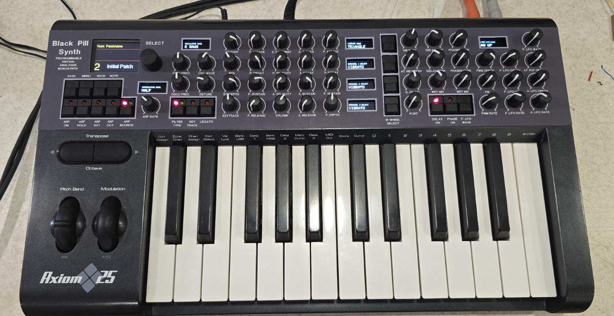
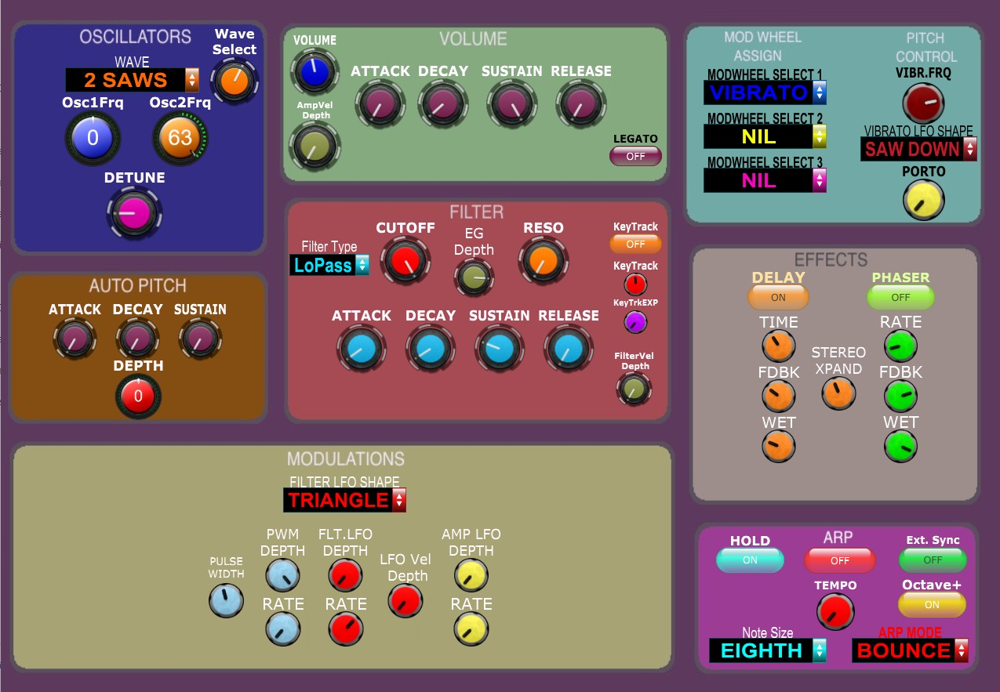

# Black-Pill-Synth-Editor

I created a hardware editor for the BP Synth to specifically fit it into the M-Audio Axiom 25 chassis.

All controls and a few extra ones are faithfully recreated on the front panel based on the BP Synth GUI.
The Axiom supports aftertouch, so I have an aftertouch depth control that diverts aftertouch to the modhweel. 
Also the pitchbend seems to be +/- 6 semitones, so I added a PB range to allow 0 to 6 semitones.

The synth was created by Blaine at SyntheTech about 3 years ago.

https://www.youtube.com/playlist?list=PLOjbFVchrTEwZxvj6SVQajDWHEZU-pO4-

